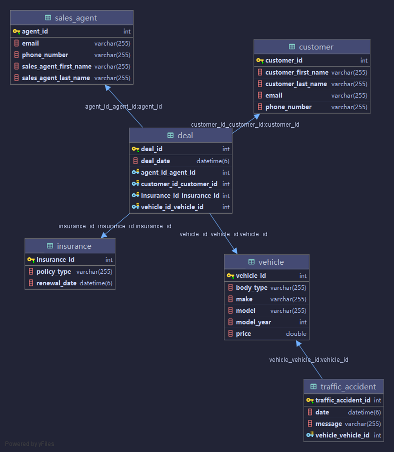

### Requests

```http request
POST http://localhost:8080/trafficAccident/add
Content-Type: application/json

{
  "vehicle": {
    "vehicleId": 1
  },
  "date": "2021-05-19T06:00:12.000+00:00",
  "message": "Traffic accident 4"
}

```
```json
{
  "trafficAccidentId": 5,
  "vehicle": 1,
  "date": "2021-05-19T06:00:12.000+00:00",
  "message": "Traffic accident 4"
}
```
```http request
GET http://localhost:8080/vehicle/list
```
```json
[
  {
    "vehicleId": 1,
    "trafficAccidents": [
      1,
      2,
      3,
      5
    ],
    "make": "make1",
    "model": "model1",
    "bodyType": "body1",
    "modelYear": 2009,
    "price": 19000.0
  }
]
```
